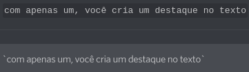
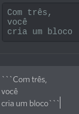
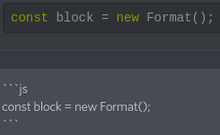

Para nossa sorte, o discord utiliza markdown. Com ele, você pode expor suas ideias, dúvidas e opiniões de uma forma mais clara, objetiva e bonita (por que não?!). Então aqui vai os exemplos mais utilizados:

## Formatação de texto

- _itálicos_: \*italics\*
- **negrito**: \*\*bold\*\*
- **_negrito itálico_**: \*\*\*bold italics\*\*\*
- ~~riscado~~: \~\~strikeout\~\~
- **sublinhado**: \_\_underline\_\_
- **_itálico sublinhado_**: \_\_\*underline - italics\*\_\_
- ****negrito sublinhado****: \_\_\*\*underline bold\*\*\_\_
- ****_negrito itálico sublinhando_****: \_\_\*\*\*underline bold italics\*\*\*\_\_

## Blocos

Para criar blocos basta você utilizar os backticks (`)

Você também pode utilizar os backticks para fazer [syntax highlighting](https://highlightjs.org/static/demo/), especificando a línguagem na primeira linha.

Pronto! Agora você já é o mestre da formatação de texto no discord. Envie mensagens bonitonas e não esqueça de compartilhar essas dicas com o resto da comunidade :rocket:
