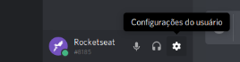
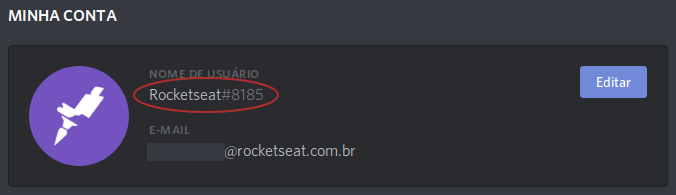

# Como obter usuário do discord

// Se você ainda não possui uma conta no discord e não faz parte da nossa comunidade, [participe](http://comunidade.rocketseat.com.br).

Para que seu nome de usuário seja único, ele é acompanhado de um descriminador (id). Como por exemplo: `Rocketseat#8185`.

Para obter, é só clicar em `Configurações do usuário`, na catraca que fica no canto inferior esquerdo:

Assim, você poderá visualizar seu nome usuário completo

É exatamente esse usuário que você precisa passar para alguém te adicionar como amigo ou preencher seu perfil no Station para fazer parte dos grupos privados :blush:
