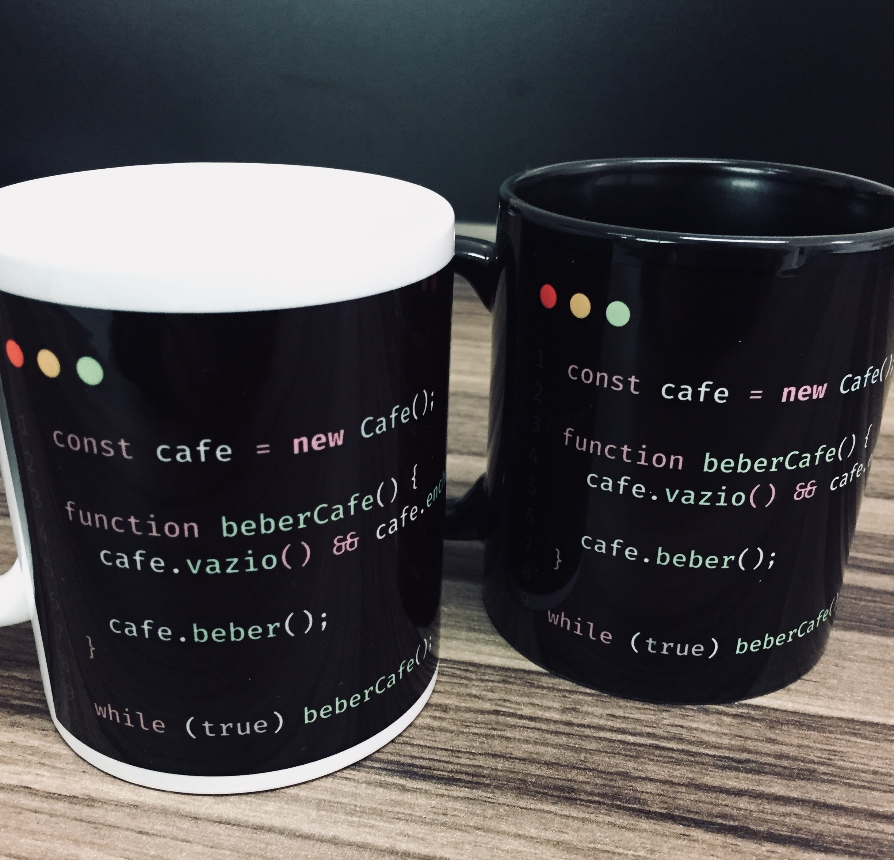

[Clique aqui para visualizar o ranking](http://comunidade.rocketseat.com.br)

Você já deve ter [entendido](https://github.com/Rocketseat/comunidade) muito bem quais são os objetivos da nossa comunidade. Com isso, percebeu que precisamos da colaboração de cada membro para que possamos construir juntos, uma comunidade forte e unida.

Como uma forma de reconher e dar feedback para os membros mais ativos, engajar ainda mais toda a comunidade e mostrar nossa gratidão, criamos um sistema de gamificação para a comunidade :rocket:

## Como funciona
É muito simples: quanto mais engajado você for, quanto mais você colaborar na construção da comunidade e na evolução dos seus membros, mais você pontua :dart:

Mas não pense que é só floodar com mensagens aleatórias... a pontuação é um pouco mais inteligente do que isso :stuck_out_tongue:

Inclusive, se você quer se dar bem, é bom que você entenda muito bem as [regras e recomendações de comportamento](https://github.com/Rocketseat/comunidade#comportamento) :grimacing:

## Premiação
Claro que os membros mais engajados da comunidade não podem passar batidos, então eles terão um belo destaque na nossa [página da comunidade](http://comunidade.rocketseat.com.br).

Tem até um pódio lá :heart_eyes:

Além disso, o membro com mais destaque no fechamento de cada mês receberá uma caneca exclusiva da Rocketseat :coffee: :rocket:

## Ranking
O [ranking](http://comunidade.rocketseat.com.br) exibe os 50 membros mais destacados no **mês**, baseado na pontuação. Os 3 primeiros ficam distintos e o que conseguir se manter em primeiro lugar leva a premiação no fim do mês.

Os pontos não são cumulativos para o ranking, ou seja, eles são zerados a cada mês.

Mas é essa mesma pontuação que define o seu level, que por sua vez, nunca zera. É ele que vai mostrar que você é o vovô da comunidade :older_man:

## Rocketbot

Você já deve conhecer o Rocketbot, ele te mandou uma mensagem de boas vindas e uma breve explicação assim que você entrou na comunidade.

Ele vai enviar todos os dias uma mensagem no chat da comunidade lembrando do [link do ranking](http://comunidade.rocketseat.com.br), quantos dias faltam para o fechamento e mostrando quem são os 3 membros mais destacados.

Além disso, quando você enviar `!rank` no privado pra ele ou em qualquer canal público, ele vai te enviar uma DM com detalhes do seu progresso e um link para visualizar o ranking.

## Como participar?

Para participar basta interagir com a comunidade, seja fazendo networking, tirando dúvidas, ajudando outras pessoas ou trocando experiências.

*Lembrando que nenhum dos moderadores ou pilots participam.*

Agora que você já entendeu tudo, bora pontuar :rocket:

**Obs: com o tempo, novas funcionalidades serão adicionadas e com isso, esse documento será modificado. Mas não se preocupe, você sempre será avisado lá na comunidade.**