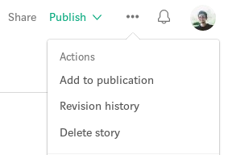
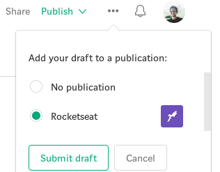

Antes de descobrir como publicar no [medium da comunidade da Rocketseat](https://medium.com/rocketseat), é importante que você entenda algumas regras. Afinal, seu artigo será revisado antes de ser publicado:

- Não é permitido qualquer tipo de anúncio comercial no artigo;
- Não é permitido qualquer tipo de prospecção ou coleta de e-mails;
- É permitido divulgar links, desde que atendam as demais regras;
- É permitido divulgar eventos, iniciativas e comunidades, desde que atendam as demais regras;
- O conteúdo deve ter relação com desenvolvimento de software e seu ecossistema em algum nível (considerando temas que envolvem evolução pessoal/profissional);
- Seu artigo é seu, se em algum momento você quiser removê-lo da nossa publicação ou excluir, você tem total liberdade;
- Você tem todo o apoio da comunidade para escrever e revisar seu artigo, basta pedir.

> Não esqueça de dar uma olhada no nosso [guia do autor](https://medium.com/rocketseat/como-comecar-a-escrever-2372e36163b8). Lá você vai entender a importância de escrever, além de dicas de como começar a escrever, como estruturar seu texto e organizar suas ideias.

## Processo de revisão e aprovação
O processo de revisão baseia-se nas regras listadas nesse documento, além de ortografia, organização e apresentação das ideias, embasamento e veracidade das informações. Ah, e claro que o artigo deve ser atraente e confortável para a pessoa que o lê.

Você irá submeter seu artigo e nos comunicaremos com você caso exista alguma consideração. Caso não exista, seu artigo vai pro ar de acordo com a fila de publicações.

### Como ser um editor
Caso você queira se transformar em um editor (ajudar a revisar os artigos), basta que você envie um e-mail para [oi@rocketseat.com.br](mailto:oi@rocketseat.com.br) com o assunto `Quero ser editor no medium` falando como você pode ajudar (não esqueça de enviar seu usúario do medium ou o link do seu perfil). *É necessário que você tenha posts publicados (em qualquer lugar) e nos envie como referência.*

## Como submeter seu artigo
Para que você possa adicionar seu artigo na publicação da Rocketseat no medium, é preciso que adicionemos você como escritor.

Para isso, basta que você envie um e-mail para [oi@rocketseat.com.br](mailto:oi@rocketseat.com.br) com o assunto `Quero publicar no medium` (não esqueça de enviar seu usúario do medium ou o link do seu perfil).

Enquanto isso, você pode escrever seu artigo como rascunho sem problema nenhum e posteriormente adicionar na nossa publicação.

## Adicionando seu artigo na publicação
Quando você se tornar um escritor, você precisa seguir estes passos para adicionar seu artigo na publicação:
- Acesse seu rascunho;
- Clique nos 3 pontinhos (`...`);
- Clique em `Add to publication`;
- Selecione `Rocketseat`;
- Clique em `Submit draft`.

Isso é tudo, basta esperar o retorno dos revisores da comunidade e seu artigo será compartilhado com o mundo :rocket: