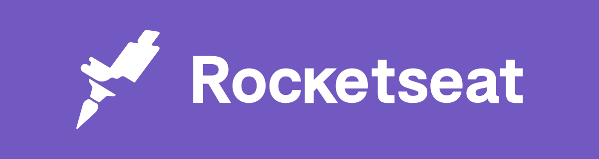
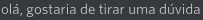
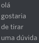
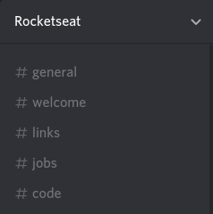
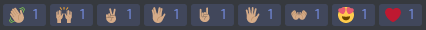

# Sobre a Comunidade Rocketseat
> Uma comunidade incrível de programadores em busca do próximo nível.
> 

A comunidade da Rocketseat é um espaço aberto focado em desenvolvimento de software e todo seu ecossistema.

Qualquer um que respeite as [regras de comportamento](#comportamento) pode participar, independente do seu nível técnico e profissional, afinal:

> Nosso objetivo é ajudar a elevar o nível de cada profissional, seja em aspectos técnicos ou não. Dessa forma, aumentando a qualidade dos seus times e produtos.

Para isso, oferecemos uma forma organizada de conectar pessoas com objetivos semelhantes para que possam trocar conhecimento, experiências e dessa forma se desenvolverem.

O networking é uma das ferramentas mais poderosas. Fique a vontade para exercitá-la aqui.

Por mais que seja o foco central, a comunidade não se limita apenas em tópicos que tem relação com código e tecnologia, mas quaisquer outros itens que colaborem com a evolução pessoal e profissional dos membros.

## Sumário
- [O que é](#sobre-a-comunidade-rocketseat)
- [Como participar](#como-participar)
- [Comportamento](#comportamento)
- [Moderação](#moderacao)
- [Denúncias](#denúncias-e-sugestões)
- [Por que Discord?](#por-que-discord)
- [Rocketseat](#rocketseat)

## Como participar
Para acessar a plataforma da comunidade, basta entrar no nosso [servidor](http://comunidade.rocketseat.com.br).
Lembrando que para isso, é necessário que você crie uma [conta no discord](https://discordapp.com/register).

Acreditamos que todos, sem exceções, sempre têm algo a aprender e ensinar.

Nesse sentido, o que esperamos de você enquanto membro ativo da comunidade é ter humildade para aprender e altruísmo para compartilhar o seu conhecimento com os outros membros.

E é dessa forma que criamos uma comunidade incrível de programadores em busca do próximo nível. :rocket:

## Comportamento
> Respeito acima de tudo.

Qualquer forma de desrespeito, em relação a qualquer aspecto não será tolerada! Essa é uma comunidade para todos, onde todos são bem-vindos e devem ser respeitados.

Para nos mantermos fortes, unidos e organizados, é preciso que algumas regras e recomendações de comportamento sejam definidas (além do bom senso):

Não utilize `@everyone` ou `@here`. Apenas envie sua mensagem. Se for um comunicado de grande importância, peça para que um dos membros da moderação envie para você.

Não mencione roles ou membros de forma aleatória para obter uma resposta. Respeite o tempo de cada um e você obterá sua resposta.

Lembre-se que a cada mensagem os membros são notificados. Por conta disso, se esforce para enviar tudo o que deseja em uma única mensagem ao invés de dar `'enters'` a cada palavra.

Prefira  ao invés de
.

Tome cuidado com flood, ninguém gosta spam.

Explore as reactions. Assim você evita mensagens desnecessárias.

Seja direto ao responder uma dúvida.

Seja ainda mais direto ao enviar uma dúvida. Deixe claro qual o seu problema e envie todas as informações necessárias para que todos possam compreender.

Todos estão aqui para compartilhar conhecimento. Dessa forma, não existem motivos para você responder uma dúvida por direct.

Seja gentil e empático sempre. Se uma pergunta é feita, essa deve ser respondida com respeito. Caso contrário, sua resposta não é bem-vinda. Lembre-se que o que parece ter resposta óbvia para você hoje, já foi uma dúvida.

### Canais
Para melhor organização dos tópicos e discussões, existem alguns canais dentro da plataforma da comunidade. Ao enviar uma mensagem, você deve entender qual o canal mais adequado.

A lista dos canais está na barra lateral esquerda:

Lembrando que você pode silenciar as notificações de canais que você não tem interesse clicando com o botão direito nele, seguido de `Silenciar`.

#### #general
Canal de tópico aberto, utilizado para qualquer objetivo que não conflite com um dos outros canais.

Este canal também é utilizado para enviar avisos e informações importantes.

#### #welcome
Canal reservado para apresentações. Para que se mantenha um histórico organizado é importante que se mantenham apenas as apresentações aqui (mas não esqueça de mandar aquele cumprimento caloroso por reaction).

#### #links
Envie todos os links que você deseja compartilhar aqui. Seja de projetos, noticias, artigos, vídeos, tecnologias ou qualquer outro tópico que você gostaria que compartilhassem com você (bom senso sempre).

Também com o objetivo de preservar um histórico organizado, evite enviar mensagens nesse canal. Ao invés disso, explore as reactions.

#### #jobs
Canal reservado para vagas. Se você está buscando ou divulgado uma vaga, o local perfeito é aqui.

Seja um emprego, freelance ou mesmo a busca por um sócio ou parceiro.

#### #code
Canal aberto para qualquer tópico relacionado a programação. Utilize para tirar suas dúvidas e iniciar discussões.

## Moderação
Os moderadores existem para manter a ordem na casa. Garantindo que as regras e recomendações de comportamento estão sendo seguidas e intervindo de forma imparcial sempre que necessário.

Moderadores não têm o direito de editar mensagens de outros membros mas podem excluir em situações extremas.

Em casos mais complexos de serem resolvidos, os moderadores tem contato direto com a equipe da Rocketseat e a decisão sobre como atuar será tomada em conjunto.

Além disso, os moderadores devem auxiliar as pessoas que possuem alguma dificuldade com a plataforma da comunidade.

### Quem são?
* Claudio Orlandi `(Claudio Orlandi#5743)`

### Como se tornar um?
Basta enviar um email para [oi@rocketseat.com.br](mailto:oi@rocketseat.com.br) com o assunto `'Quero ser moderador'` respondendo as perguntas:
* Por que você quer ser moderador?
* Em quais horários você estaria ativo na comunidade?
* Você possui alguma experiência com moderação?
* Você participa de outras comunidades?

## Denúncias e sugestões
Se você se sentiu desrespeitado ou percebeu que algum membro está descumprindo as regras de comportamento, você pode entrar em contato no privado diretamente com os moderadores ou enviar um e-mail para [oi@rocketseat.com.br](mailto:oi@rocketseat.com.br). Sugestões também são muito bem-vindas.

## Por que Discord?
Testamos várias plataformas, rodamos por alguns meses no slack e cogitamos a possibilidade de desenvolver a nossa plataforma. No fim, optamos pelo [Discord](https://discordapp.com/features) e estes são os principais motivos:
- Totalmente gratuito
- Canais de voz com qualidade
- Compartilhamento de tela
- Permissões simples de configurar
- Ótima organização por roles
- Ótima organização por categorias
- Fácil de integrar
- Extremamente leve
- Interface simples e intuitiva
- Muiti plataforma e possui versão web
- Ferramenta em ascensão
- Suporte ágil e de qualidade

### Mas o Discord não é focado em jogos?
Apesar de possuir esse foco, ele não se limita apenas aos jogos. Além disso, já está mais do que provado que ele atende muito bem nossas necessidades. Outras empresas e comunidades de devs também já utilizam a plataforma, como por exemplo o [Reactiflux](https://reactjs.org/community/support.html#reactiflux-chat).

## Rocketseat
Para conhecer um pouco mais sobre a Rocketseat, acompanhe-nos nas redes sociais:
* [Site](https://rocketseat.com.br)
* [Blog](https://rocketseat.com.br/blog)
* [Facebook](https://facebook.com/rocketseat)
* [Youtube](https://www.youtube.com/rocketseat)
* [Twitter](https://twitter.com/rocketseat)
* [Instagram](https://www.instagram.com/rocketseat_oficial)
* [Linkedin](https://www.linkedin.com/company/rocketseat)

[Para participar da comunidade basta clicar aqui.](http://comunidade.rocketseat.com.br)